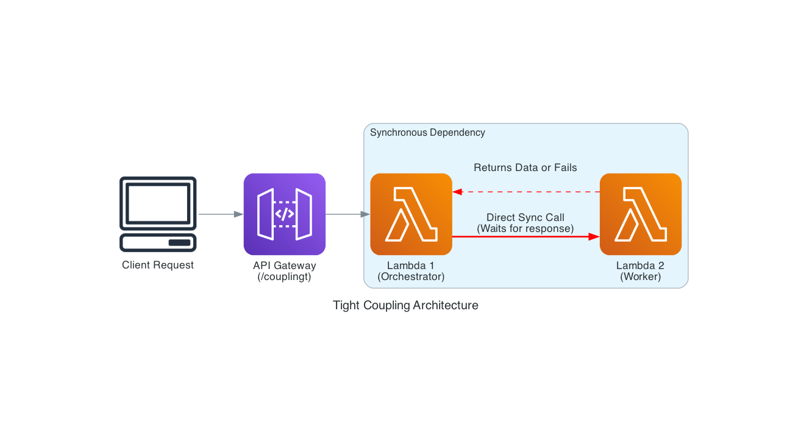
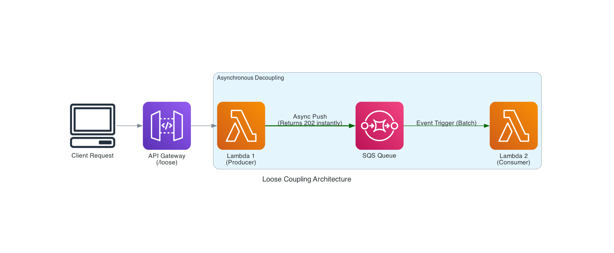

# 🔗 Tight vs. Loose Coupling in AWS

This project demonstrates the fundamental architectural difference between **Tight Coupling** and **Loose Coupling** in serverless environments. It compares a direct synchronous Lambda-to-Lambda call against an asynchronous event-driven pattern using Amazon SQS.

---

## 🏗️ Architecture Diagrams

### 1. Tight Coupling (Synchronous)
In this pattern, the Orchestrator Lambda calls the Worker Lambda directly and waits for a response.
- **Risk**: If the Worker fails or is slow, the Orchestrator also hangs or fails.
- **Latency**: Cumulative (Orchestrator Time + Worker Time).



### 2. Loose Coupling (Asynchronous)
In this pattern, the Producer Lambda pushes a message to an SQS Queue and returns a success response to the client immediately.
- **Benefit**: Decouples services. If the Consumer is down, messages stay safe in the queue.
- **Scalability**: Handles bursts of traffic much better through buffering.



---

## 🛠️ Infrastructure Breakdown

### Tight Coupling (`/projects/coupling/tight`)
- **API Gateway**: Endpoint `/couplingt`
- **Lambda-1 (Orchestrator)**: Uses `boto3.client('lambda').invoke()` with `InvocationType='RequestResponse'`.
- **Lambda-2 (Worker)**: Processes the request and returns data to Lambda-1.

### Loose Coupling (`/projects/coupling/loose`)
- **API Gateway**: Endpoint `/loose`
- **Lambda-1 (Producer)**: Uses `boto3.client('sqs').send_message()`.
- **SQS Queue**: Acts as the message buffer.
- **Lambda-2 (Consumer)**: Triggered by SQS to process messages in batches.

---

## 📈 Benchmarking Results

Stress tests were conducted using **Locust** to measure performance under load.

- **Tight Coupling**: Showed higher failure rates and increased latency as concurrent requests scaled up, due to synchronous waiting.
- **Loose Coupling**: Maintained stable response times for the client, as work was offloaded to the background queue.

> You can find the full benchmarking reports in the `benchMarking/` folders within each project directory.

---

## 🚀 How to Deploy

Each pattern is defined using AWS CloudFormation:

1. **Tight Coupling**:
   ```bash
   aws cloudformation deploy --template-file projects/coupling/tight/cloudformation/build-tight.yaml --stack-name tight-coupling
   ```

2. **Loose Coupling**:
   ```bash
   aws cloudformation deploy --template-file projects/coupling/loose/cloudFormation/build.yaml --stack-name loose-coupling
   ```
