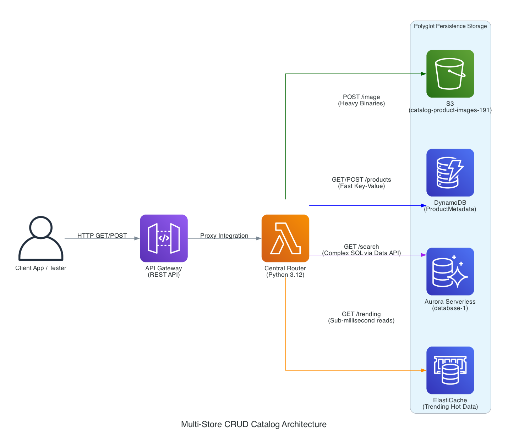

# 🛒 Multi-Store CRUD Catalog (Polyglot Persistence)

A high-performance serverless backend demonstrating **Polyglot Persistence** in AWS. This project uses a single Lambda "Central Router" to orchestrate data across S3, DynamoDB, and Aurora RDS based on the access pattern requirements.

---

## 🏗️ Architecture Overview

The system is designed to handle different types of data with the most appropriate storage engine:
- **Images/Binaries**: Stored in **Amazon S3**.
- **Metadata/NoSQL**: High-speed key-value lookups in **Amazon DynamoDB**.
- **Relational Search**: Complex SQL queries via **Amazon Aurora Serverless (v2)**.
- **Caching**: Sub-millisecond performance via **Amazon ElastiCache** (Redis).



---

## 🚀 Key Features

- **Centralized Routing**: A single Python 3.12 Lambda function handles multiple API routes.
- **Image Processing Pipeline**: 
    - Decodes Base64 image payloads.
    - Uploads to S3 with unique UUID keys.
    - Persists metadata (URL, size, timestamp) to DynamoDB.
- **Relational Search**: Uses the AWS Data API to execute SQL queries against Aurora without managing persistent connection pools.
- **CORS Enabled**: Ready for frontend integration with full Cross-Origin Resource Sharing headers.

---

## 📂 Project Structure

```
multi-store-crud-catalog/
├── architecture/
│   ├── architecture.py         # Diagrams-as-Code source
│   └── multi-store_crud_...png  # System Architecture
├── lambda/
│   └── lambda.py               # Central Router Logic
├── screenshots/                # AWS Console & UI Previews
└── testing/
    └── test.html               # Frontend Test Harness
```

---

## 🛠️ API Endpoints

| Method | Path | Description | Storage Backend |
| :--- | :--- | :--- | :--- |
| `POST` | `/products/image` | Upload product image & metadata | S3 + DynamoDB |
| `GET` | `/products` | Fast lookup by ProductID | DynamoDB |
| `GET` | `/products/search` | Complex search by category | Aurora RDS |

---

## 🔧 Setup & Deployment

1. **S3 Bucket**: Create a bucket named `catalog-product-images-191`.
2. **DynamoDB**: Create a table `ProductMetadata` with `ProductID` as Partition Key.
3. **Aurora RDS**: Provision an Aurora Serverless v2 cluster and enable the **Data API**.
4. **Lambda**: Deploy `lambda/lambda.py` and attach the necessary IAM policies for S3, DynamoDB, and RDS Data API access.
